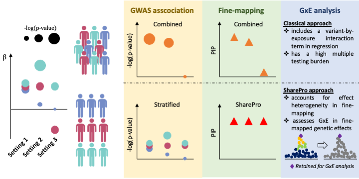
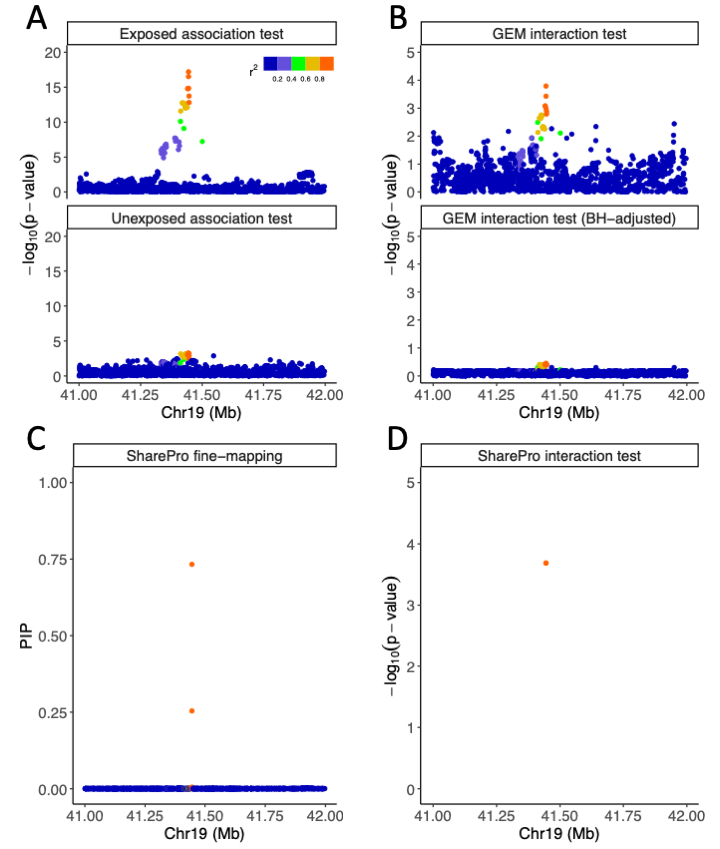

# SharePro for joint fine-mapping and GxE analysis

SharePro is a computational method to account for genetic effect heterogeneity in fine-mapping and improve power to detect gene-environment interactions (GxE). For analysis conducted in the research paper, please refer to [SharePro_gxe_analysis](https://github.com/zhwm/SharePro_gxe_analysis).

## Overview 

Characterizing genetic effect heterogeneity across subpopulations with different environmental exposures is useful in understanding disease heterogeneity within a population and further pinpointing modifiable risk factors for disease prevention and management. 
Classical GxE analysis can be used to detect genetic effect heterogeneity. However, it can have a high multiple testing burden in the context of genome-wide association studies and requires a large sample size to achieve sufficient power.

We developed SharePro for GxE analysis to reduce multiple testing burden.
Below we showcase three scenarios of potential effect heterogeneity in a population with three environmental exposure status. 
In setting 1, there is no effect heterogeneity and through combined analysis, the causal variant can be identified while a stratified GWAS analysis is under-powered. 
Through joint analysis of exposure-stratified GWAS summary statistics, we can recover this signal with SharePro.
In setting 2, the causal variant has different effect sizes across exposure categories and combined approaches will be disadvantaged. 
Classical GxE analysis is not well-powered either due to a high multiple testing burden. 
With a joint approach, SharePro can accurately identify the causal signal and detect effect heterogeneity. Setting 3 is similar to setting 2 where the joint approach is more favorable than the combined approach.

<p align="center">
  
  <br>
  <em>Figure 1: SharePro for GxE analysis overview.</em>
</p>

## Installation

SharePro was developed under Python 3.9.7 environment but should be compatible with older versions of Python 3. The following Python modules are required:

* [numpy](http://www.numpy.org/)
* [scipy](http://www.scipy.org/)
* [pandas](https://pandas.pydata.org/getpandas.html)

To install SharePro for joint fine-mapping and GxE analysis:

```
git clone https://github.com/zhwm/SharePro_gxe.git
cd SharePro_gxe
pip install -r requirements.txt 
``` 

To test the installation and display basic usage:
```
python sharepro_gxe.py -h
```

## Input files

Example input files from simulation studies are included in the [dat](dat/) directory.

SharePro takes in a summary file with path to z-score files and LD files, exposure stratified z-scores files, LD files as inputs.

1. **a summary file** contains two mandatory columns: names of z-score file and ld files. Multiple files are allowed and should be separated by comma. An example can be found at [dat/CL.zld.txt](dat/CL.zld.txt).

2. **exposure stratified zscore files** that contain two mandatory columns: variant IDs and z-scores. Examples are available at [dat/C21.z](dat/C21.z) and [dat/L21.z](dat/L21.z). Multiple exposure categories are allowed.

3. **LD files** that contain correlation coefficient matrix. **Please make sure the REF/ALT alleles used in calculating LD are the same as the GWAS study!!** An example can be found at [dat/Locus1.ld](dat/Locus1.ld) and a working script for matching raw GWAS summary statistics and PLINK bim file is provided [here](match_bim_ss.py).
## Usage examples

We use `--zld` to indicate path to the summary file and `--zdir` to indicate path to zscore files.
Additionally, we specify the sample sizes of each exposure categories with `--N`.
We use `--save` to specify path to save result and `--prefix` to specify prefix of output files. We set the max number of causal signals as 10 with `--K`.

```
python sharepro_gxe.py \
--zld dat/CL.zld.txt \
--zdir dat \
--N 25000 25000 \
--save res \
--prefix CL \
--verbose \
--K 10
```

## Output interpretation

In this simulated example, we have one causal variant: rs112819506 with causal effect sizes of 0.05 and 0.02 in the exposed and unexposed group.

From the output we obtained below, we have successfully identified one effect group consisting of two variants rs112819506 and rs138116565 with weights of 0.7334 and 0.2541. Since those two variants have a Pearson correlation of 0.99, they are nearly statistically indistinguishable.
Based on the estimated effect size of 0.0533 and 0.0205, a GxE p-value of 2.06e-04 was derived for charactering effect heterogeneity for this effect group.

```
**********************************************************************
* SharePro for joint fine-mapping and GxE analysis                   *
* Version 1.0.0                                                      *
* (C) Wenmin Zhang (wenmin.zhang@mail.mcgill.ca)                     *
**********************************************************************
Using locus fine-mapping mode with --zld
LD list with 1 LD blocks loaded

processing C21.z,L21.z
**********************************************************************
Iteration-->0 . Likelihood: 42.4 . KL_b: -4.7 . KL_c: -12.6 . KL_s: 69.7 . ELBO: 94.8
**********************************************************************
Iteration-->1 . Likelihood: 42.2 . KL_b: -4.6 . KL_c: -12.4 . KL_s: 69.8 . ELBO: 95.0
**********************************************************************
Iteration-->2 . Likelihood: 42.2 . KL_b: -4.6 . KL_c: -12.4 . KL_s: 69.8 . ELBO: 95.0
**********************************************************************
Iteration-->3 . Likelihood: 42.2 . KL_b: -4.6 . KL_c: -12.4 . KL_s: 69.8 . ELBO: 95.0
total probabilities 2.0396
entropy of posterior distribution:[0.65 7.67 7.67 7.68 7.68 7.68 7.68 7.68 7.69 7.69]
The 0-th effect contains effective variants:
causal variants: ['rs112819506', 'rs138116565']
variant probabilities for this effect group: [0.7334 0.2541]
shared probability for this effect group: 0.9399
specific probabilities for this effect group: [0.0601, 0.0]
probabilities of effect for traits: [1.0, 0.9399]
causal effect sizes for traits: [0.0533, 0.0205]
GxE p-value: 2.06e-04
```

We can additionally visualize both the raw GWAS summary statistics (A) and the GxE analysis results (B,D) in this locus.
Specifically, multiple testing burden in classical GxE detection reduced the power for characterizing genetic effect heterogeneity (B) while SharePro can identify the causal signal first, which greatly increases power for GxE analysis (D).

<p align="center">
  
  <br>
  <em>Figure 1: SharePro usage example.</em>
</p>

## Output files

1. **effect group summary** (cs) file contains seven columns: 
`cs` for variant representation in effect groups; 
`totalProb` for overall probability weights for effect groups; 
`p_diff` for GxE p-value;
`beta` for causal effect sizes;
`share` for effect group being causal in all exposure categories;
`specific` for effect group being causal for specific exposure category;
`causalProb` for effect group being causal for each exposure category; 
`variantProb` for variant representation weight in effect groups.

```
$> cat C21.z_L21.z.cs 
cs	totalProb	p_diff	beta	share	specific	causalProb	variantProb
rs112819506/rs138116565	0.9874	2.06e-04	0.0533,0.0205	0.9399	0.0601,0.0	1.0,0.9399	0.7333/0.2541
```

2. **variant summary** (snp) file contains zscores and one additional column of posterior inclusion probabilities.

```
$> head -5 C21.z_L21.z.snp
SNP	C21.z	L21.z	vProb
rs111073422	0.6018	0.0611	4.41e-04
rs10414006	-1.9531	1.83	5.59e-04
rs188970225	1.1552	-0.4448	4.49e-04
rs814535	-1.8894	1.6999	5.27e-04
```

3. **hyperparameters summary** (h2) file adds two additional columns in the summary file to record the heritability and effect size variance estimates used in the algorithm.

```
$> cat CL.h2 
z	ld	h2	varb
C21.z,L21.z	Locus1.ld,Locus1.ld	0.00044065478459138374	0.001690981489
```